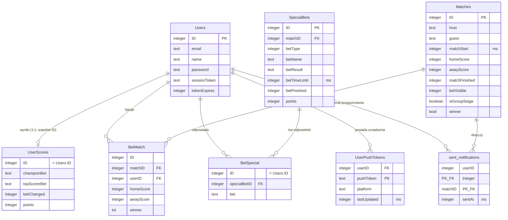

# Obstawiator — dokumentacja bazy danych (Cloudflare D1)

Baza: **obstawiatorDB** (Cloudflare D1 / SQLite). Wszystkie znaczniki czasu są przechowywane jako liczby całkowite w **milisekundach** epoki Unix (kompatybilne z JS `Date.now()`).

> Uwaga ogólna: SQLite traktuje typy deklaratywnie (type affinity), więc kolumny `boolean`/`bool` są fizycznie liczbami całkowitymi (0/1).

---

## Diagram relacji

---

## Tabele

### Users
Konta użytkowników wraz z danymi sesji.

| Kolumna | Typ | Opis |
|---|---|---|
| `ID` | INTEGER, **PK** | Identyfikator użytkownika. |
| `email` | TEXT | Adres e-mail (login). |
| `name` | TEXT | Nazwa wyświetlana. |
| `password` | TEXT | Hasło (hash). |
| `sessionToken` | TEXT | Token aktywnej sesji. |
| `tokenExpires` | INTEGER | Wygaśnięcie sesji (ms). |

### UserScores
Punktacja i typy "długoterminowe" użytkownika. Relacja 1:1 z `Users` — `ID` jest tożsame z `Users.ID`.

| Kolumna | Typ | Opis |
|---|---|---|
| `ID` | INTEGER, **PK** | = `Users.ID`. |
| `championBet` | TEXT | Wytypowany mistrz turnieju. |
| `topScorerBet` | TEXT | Wytypowany król strzelców. |
| `betChanged` | INTEGER | Flaga/licznik zmiany typu. |
| `points` | INTEGER | Suma punktów użytkownika. |

### Matches
Mecze turnieju.

| Kolumna | Typ | Opis |
|---|---|---|
| `ID` | INTEGER, **PK** | Identyfikator meczu. |
| `host` | TEXT | Gospodarz. |
| `guest` | TEXT | Gość. |
| `matchStart` | INTEGER | Początek meczu (ms). |
| `homeScore` | INTEGER | Bramki gospodarza (po meczu). |
| `awayScore` | INTEGER | Bramki gościa (po meczu). |
| `matchFinished` | INTEGER | Czy mecz zakończony (0/1). |
| `betVisible` | INTEGER | Czy zakład widoczny dla użytkowników (0/1). |
| `isGroupStage` | BOOLEAN | Czy mecz fazy grupowej. |
| `winner` | BOOL | Zwycięzca meczu (faza pucharowa). |

### BetMatch
Typy użytkowników na poszczególne mecze. Para `(matchID, userID)` powinna być unikalna (logicznie), choć nie jest to wymuszone w schemacie.

| Kolumna | Typ | Opis |
|---|---|---|
| `ID` | INTEGER | Identyfikator wiersza (bez constraintu PK). |
| `matchID` | INTEGER | → `Matches.ID`. |
| `userID` | INTEGER | → `Users.ID`. |
| `homeScore` | INTEGER | Typowany wynik gospodarza. |
| `awayScore` | INTEGER | Typowany wynik gościa. |
| `winner` | INT | Typowany zwycięzca (faza pucharowa). |

### SpecialBets
Definicje zakładów specjalnych (mogą, ale nie muszą być powiązane z meczem).

| Kolumna | Typ | Opis |
|---|---|---|
| `ID` | INTEGER, **PK** | Identyfikator zakładu specjalnego. |
| `matchID` | INTEGER | → `Matches.ID` (opcjonalnie). |
| `betType` | INTEGER | Typ zakładu (enum aplikacyjny). |
| `betName` | TEXT | Nazwa/treść zakładu. |
| `betResult` | TEXT | Rozstrzygnięcie. |
| `betTimeLimit` | INTEGER | Termin obstawiania (ms). |
| `betFinished` | INTEGER | Czy rozstrzygnięty (0/1). |
| `points` | INTEGER | Punkty za trafienie. |

### BetSpecial
Odpowiedzi użytkowników na zakłady specjalne.

| Kolumna | Typ | Opis |
|---|---|---|
| `ID` | INTEGER | = `Users.ID` (brak constraintu PK/FK). |
| `specialBetID` | INTEGER | → `SpecialBets.ID`. |
| `bet` | TEXT | Treść odpowiedzi użytkownika. |

### UserPushTokens
Tokeny FCM urządzeń użytkownika (wiele urządzeń na konto).

| Kolumna | Typ | Opis |
|---|---|---|
| `userID` | INTEGER | → `Users.ID`. |
| `pushToken` | TEXT, **PK** | Token FCM urządzenia. |
| `platform` | TEXT | Platforma (web/android/ios). |
| `lastUpdated` | INTEGER | Ostatnia aktualizacja tokenu (ms). |

### sent_notifications
Rejestr wysłanych przypomnień push (deduplikacja — worker crona nie wysyła dwa razy przypomnienia o tym samym meczu do tego samego użytkownika).

| Kolumna | Typ | Opis |
|---|---|---|
| `userID` | INTEGER, **PK** (część) | → `Users.ID`. |
| `matchID` | INTEGER, **PK** (część) | → `Matches.ID`. |
| `sentAt` | INTEGER | Moment wysyłki (ms). |

---

## Procesy korzystające z bazy

- **Worker `obstawiator-cron`** (co 5 min): wyszukuje mecze startujące w ciągu 12 h, dla których użytkownik z tokenem push nie ma wpisu w `BetMatch` ani w `sent_notifications`, wysyła przypomnienie przez FCM v1 i zapisuje wpis w `sent_notifications`.

## Znane ograniczenia schematu / dług techniczny

1. **Brak kluczy obcych** — relacje (`userID`, `matchID`, `specialBetID`) nie są wymuszane przez bazę; spójność pilnowana w aplikacji.
2. **Brak PK w `BetMatch` i `BetSpecial`** — możliwe duplikaty; warto dodać `PRIMARY KEY` lub unikalne indeksy, np. `UNIQUE(matchID, userID)` w `BetMatch`.
3. **Brak indeksów pod zapytania crona** — przy większej liczbie rekordów przyda się `CREATE INDEX idx_betmatch_user_match ON BetMatch(matchID, userID);` oraz `CREATE INDEX idx_matches_start ON Matches(matchStart);`.
4. **`sent_notifications`** — tabela przyrostowa; zalecane okresowe czyszczenie wpisów starszych niż ~30 dni.
